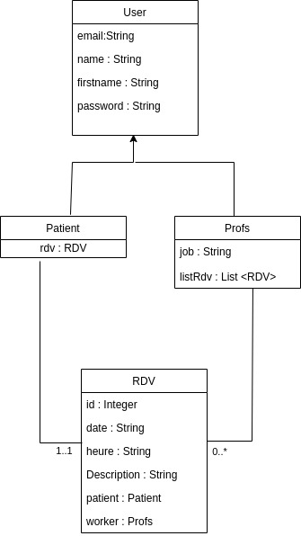
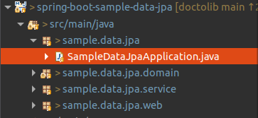
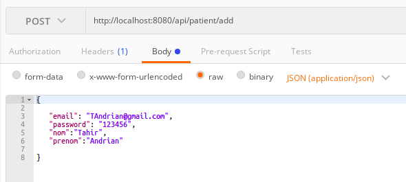
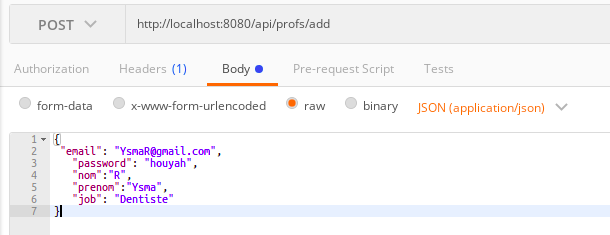
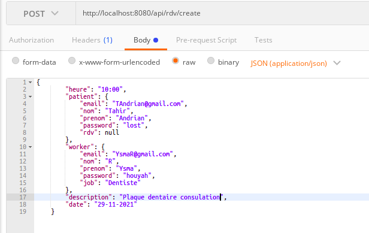

# doctolib

# Installer mysql et phpmyadmin à l’aide de docker

Pré-requis : installation de docker sur sa machine. Tuto :  https://docs.docker.com/engine/install/ubuntu/

Une fois docker installé (ou si déjà installé) executez la commande suivant : 

Pour stop mysql si il est installé sur notre machine

```bash
sudo service mysql stop

```

Pour démarrer la base de données avec docker : 

```bash
docker run --name some-mysql  -p 3306:3306 -e MYSQL_ROOT_PASSWORD=my-secret-pw -d mysql:latest

```

Pour démarrer phpmyadmin avec docker.

```bash
docker run --name myadmin -d --link some-mysql:db -p 8082:80 phpmyadmin

```

Ouvrez un navigateur et allez sur http://localhost:8082

Utilisateur : root

Mot de passe : my-secret-pw

Pour redémarrer les containers après un reboot de la machine : 

```bash
docker start some-mysql myadmin 

```

et pour l'arrêter
```bash
docker start some-mysql myadmin 

```

Il est important que la base de donnée soit lancer.


# Diagramme de classe du domaine : 
<p align="center">
  
</p>


Pour lancer l'application, ouvez le projet dans un IDE de votre choix (éclipse ou inteliJ) puis lancez SampleDataJpaApplication.java : 
Click droit dessus -> run as -> Java Application.

<p align="center">
  
</p>

# Quelques teste réalisés

Installation de postman : https://chrome.google.com/webstore/detail/postman/fhbjgbiflinjbdggehcddcbncdddomop


Allez sur postman puis dans la barre url, mettez y : http://localhost:8080/api/patient/add et les information suivant en format <b>JSON </b> pour ajouter un patient: 

```json
{
 "email": "TAndrian@gmail.com",
   "password": "lost",
   "nom":"Tahir",
   "prenom":"Andrian"
}
```

<p align="center">
  
</p>

 http://localhost:8080/api/profs/add pour ajouter un professionnel: 

```json
{
 "email": "YsmaR@gmail.com",
   "password": "houyah",
   "nom":"R",
   "prenom":"Ysma",
   "job": "Dentiste"
}
```

<p align="center">
  
</p>
et http://localhost:8080/api/rdv/create pour ajouter un rendez-vous : 

```json
{		
		"heure": "10:00",
        "patient": {
            "email": "TAndrian@gmail.com",
            "nom": "Tahir",
            "prenom": "Andrian",
            "password": "lost",
            "rdv": null
        },
        "worker": {
            "email": "YsmaR@gmail.com",
            "nom": "R",
            "prenom": "Ysma",
            "password": "houyah",
            "job": "Dentiste"
        },
        "description": "Plaque dentaire consulation",
        "date": "29-11-2021"
}
```
<p align="center">
  
</p>

Vous pouvez changer les informations à votre guise!

Appuyez sur SEND pour envoyer vous requêtes et consulez la base de donnée.

